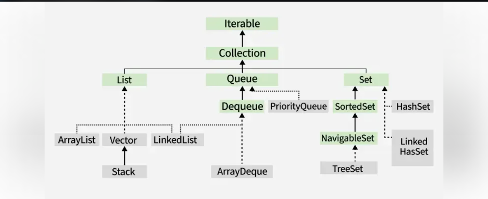

# Java Collection Framework - Comprehensive Technical Notes

## Table of Contents
1. [Why Collections?](#1-why-collections)
2. [Collection Framework Overview](#2-collection-framework-overview)
3. [Collection Hierarchy](#3-collection-hierarchy)
4. [ArrayList](#4-arraylist)
5. [LinkedList](#5-linkedlist)
6. [ArrayDeque](#6-arraydeque)
7. [PriorityQueue](#7-priorityqueue)
8. [HashSet](#8-hashset)
9. [LinkedHashSet](#9-linkedhashset)
10. [TreeSet](#10-treeset)
11. [Iterator & ListIterator](#11-iterator--listiterator)
12. [Legacy Classes & Enumeration](#12-legacy-classes--enumeration)
13. [Introduction to Map](#13-introduction-to-map)
14. [Map Hierarchy](#14-map-hierarchy)
15. [HashMap](#15-hashmap)

---

## 1. Why Collections?

### Explanation
Before Collections Framework, Java provided ad-hoc classes like `Vector`, `Hashtable`, `Stack`, and arrays to store and manipulate groups of objects. These approaches had several limitations:

**Problems without Collections Framework:**
- No standard interface across different data structures
- Difficult to learn and use multiple APIs
- Limited functionality (e.g., no built-in sorting, searching algorithms)
- Arrays have fixed size and lack dynamic resizing
- Manual memory management for complex data structures

**Benefits of Collections Framework:**
1. **Reduced Programming Effort** - Ready-to-use data structures
2. **Increased Performance** - Optimized implementations
3. **Interoperability** - Common interfaces enable easy switching
4. **Code Reuse** - Algorithms work on different collections
5. **Type Safety** - Generics prevent runtime type errors

### Real-World Applications
- Storing user sessions in web applications
- Managing database query results
- Implementing caching mechanisms
- Processing batch operations
- Building complex algorithms like graph traversals

---

## 2. Collection Framework Overview

### Core Interfaces
```java
// Main interfaces in Collections Framework
Collection<E> (Root interface)
    ├── List<E> (Ordered collection with duplicates)
    ├── Set<E> (Unique elements, no duplicates)
    └── Queue<E> (FIFO or priority ordering)
        └── Deque<E> (Double-ended queue)
```

### Key Features
- **Generic** - Type-safe collections
- **Algorithm-rich** - Sorting, searching, shuffling
- **Iterable** - Enhanced for-loop support
- **Serializable** - Can be saved/transmitted
- **Cloneable** - Can be duplicated
- **Thread-safe options** - Concurrent collections

### Framework Architecture
```
java.util.Collections (Utility class)
java.util.Arrays (Utility class for arrays)
Collection Interfaces
    ↓
Abstract Classes (partial implementations)
    ↓
Concrete Implementations
```

---

## 3. Collection Hierarchy

```java
// Complete hierarchy diagram
Iterable<E>
    ↓
Collection<E>
    ├── List<E>
    │   ├── ArrayList<E>
    │   ├── LinkedList<E>
    │   └── Vector<E> (Legacy)
    │       └── Stack<E> (Legacy)
    ├── Set<E>
    │   ├── HashSet<E>
    │   │   └── LinkedHashSet<E>
    │   └── SortedSet<E>
    │       └── TreeSet<E>
    └── Queue<E>
        ├── PriorityQueue<E>
        └── Deque<E>
            └── ArrayDeque<E>
```

### Key Characteristics Table

| Interface | Duplicates | Order | Null Allowed | Implementations |
|-----------|------------|-------|--------------|-----------------|
| List | Yes | Insertion Order | Yes (depends) | ArrayList, LinkedList, Vector |
| Set | No | Varies | Varies | HashSet, LinkedHashSet, TreeSet |
| Queue | Yes | Processing Order | Varies | PriorityQueue, ArrayDeque, LinkedList |
| Deque | Yes | Both ends | Varies | ArrayDeque, LinkedList |

---

## 4. ArrayList

### Explanation
`ArrayList` is a resizable array implementation of the `List` interface. It provides fast random access but slower insertions/deletions in the middle.

### Internal Implementation
```java
// Behind the scenes
transient Object[] elementData;  // Backing array
private int size;                // Current size
private static final int DEFAULT_CAPACITY = 10;
```

### Code Examples
```java
import java.util.ArrayList;
import java.util.Collections;
import java.util.Iterator;

public class ArrayListDemo {
    public static void main(String[] args) {
        // Creation
        ArrayList<String> list = new ArrayList<>();
        ArrayList<Integer> numbers = new ArrayList<>(20); // Initial capacity
        
        // Adding elements
        list.add("Java");
        list.add("Python");
        list.add("C++");
        list.add(1, "JavaScript"); // Insert at specific position
        
        // Accessing elements
        String first = list.get(0);
        int size = list.size();
        boolean exists = list.contains("Java");
        
        // Iterating
        // 1. Enhanced for loop
        for (String language : list) {
            System.out.println(language);
        }
        
        // 2. Iterator
        Iterator<String> iterator = list.iterator();
        while (iterator.hasNext()) {
            System.out.println(iterator.next());
        }
        
        // 3. ForEach with lambda
        list.forEach(lang -> System.out.println(lang));
        
        // Modifying
        list.set(2, "C#"); // Replace element
        list.remove("Python"); // Remove by object
        list.remove(0); // Remove by index
        
        // Bulk operations
        ArrayList<String> newList = new ArrayList<>();
        newList.add("Go");
        newList.add("Rust");
        list.addAll(newList);
        
        // Sorting
        Collections.sort(list);
        
        // Converting to array
        String[] array = list.toArray(new String[0]);
        
        // Clearing
        list.clear();
        boolean isEmpty = list.isEmpty();
    }
}
```

### Performance Characteristics
| Operation | Time Complexity | Notes |
|-----------|----------------|-------|
| get(index) | O(1) | Direct array access |
| add(element) | Amortized O(1) | May trigger resize |
| add(index, element) | O(n) | Requires shifting |
| remove(index) | O(n) | Requires shifting |
| contains(element) | O(n) | Sequential search |
| set(index, element) | O(1) | Direct replacement |

### Interview Questions
1. **Q:** How does ArrayList resize itself?
   **A:** When capacity is exceeded, it creates a new array with 50% more capacity (newCapacity = oldCapacity + (oldCapacity >> 1)) and copies elements.

2. **Q:** What happens when you add null to ArrayList?
   **A:** ArrayList allows null values unless restricted by specific implementations.

3. **Q:** Why is ArrayList not thread-safe?
   **A:** Its methods are not synchronized. Use `Collections.synchronizedList()` or `CopyOnWriteArrayList` for thread safety.

4. **Q:** What's the difference between `size()` and `capacity()`?
   **A:** `size()` returns number of elements; `capacity()` returns the length of backing array (not exposed in API).

### Comparison: ArrayList vs Array

| Aspect | Array | ArrayList |
|--------|-------|-----------|
| Size | Fixed at creation | Dynamic resizing |
| Type Safety | Compile-time (for primitives) | Runtime (with generics) |
| Performance | Faster (no overhead) | Slightly slower (object wrapper) |
| Methods | Limited (length field) | Rich API (add, remove, etc.) |
| Memory | Contiguous memory | Contiguous + overhead |

### Real-World Applications
- Storing paginated database results
- Implementing shopping cart items
- Managing user input lists
- Caching frequently accessed data

---

## 5. LinkedList

### Explanation
`LinkedList` is a doubly-linked list implementation of `List` and `Deque` interfaces. It provides efficient insertions/deletions but slower random access.

### Internal Structure
```java
// Node structure
private static class Node<E> {
    E item;
    Node<E> next;
    Node<E> prev;
    
    Node(Node<E> prev, E element, Node<E> next) {
        this.item = element;
        this.next = next;
        this.prev = prev;
    }
}
```

### Code Examples
```java
import java.util.LinkedList;
import java.util.ListIterator;

public class LinkedListDemo {
    public static void main(String[] args) {
        // Creation
        LinkedList<String> linkedList = new LinkedList<>();
        
        // Adding elements
        linkedList.add("First");
        linkedList.add("Second");
        linkedList.addFirst("New First");  // Add at beginning
        linkedList.addLast("Last");        // Add at end
        linkedList.add(2, "Middle");       // Insert at position
        
        // Queue operations (FIFO)
        linkedList.offer("Offered");       // Add to end
        String peeked = linkedList.peek(); // View first without removing
        String polled = linkedList.poll(); // Remove and return first
        
        // Stack operations (LIFO)
        linkedList.push("Pushed");         // Add to front
        String popped = linkedList.pop();  // Remove from front
        
        // Accessing elements
        String first = linkedList.getFirst();
        String last = linkedList.getLast();
        String byIndex = linkedList.get(3);
        
        // Searching
        int firstIndex = linkedList.indexOf("First");
        int lastIndex = linkedList.lastIndexOf("First");
        
        // Iterating with ListIterator (bidirectional)
        ListIterator<String> iterator = linkedList.listIterator();
        while (iterator.hasNext()) {
            String element = iterator.next();
            if (iterator.hasPrevious()) {
                // Can go backward
                String previous = iterator.previous();
                iterator.next(); // Move forward again
            }
        }
        
        // Converting to array
        Object[] array = linkedList.toArray();
        
        // Performance demonstration
        long startTime = System.nanoTime();
        linkedList.get(linkedList.size() / 2); // O(n) access
        long endTime = System.nanoTime();
    }
}
```

### Performance Characteristics

| Operation | Time Complexity | Notes |
|-----------|----------------|-------|
| add(element) | O(1) | Adds to end |
| add(index, element) | O(n) | Needs traversal |
| get(index) | O(n) | Sequential access |
| remove(index) | O(n) | Needs traversal |
| remove(element) | O(n) | Needs traversal |
| addFirst() / removeFirst() | O(1) | Direct head access |

### Interview Questions
1. **Q:** When would you choose LinkedList over ArrayList?
   **A:** When frequent insertions/deletions at beginning/middle are needed, or when implementing stacks/queues.

2. **Q:** How does LinkedList handle memory compared to ArrayList?
   **A:** LinkedList uses more memory per element (node objects with pointers), while ArrayList uses contiguous memory.

3. **Q:** Can LinkedList contain null elements?
   **A:** Yes, LinkedList allows null elements.

4. **Q:** What is the default initial capacity of LinkedList?
   **A:** LinkedList has no initial capacity - it starts empty and grows with each addition.

### Comparison: ArrayList vs LinkedList

| Aspect | ArrayList | LinkedList |
|--------|-----------|------------|
| Internal Structure | Dynamic array | Doubly-linked list |
| Random Access | O(1) - Excellent | O(n) - Poor |
| Insert at End | Amortized O(1) | O(1) |
| Insert at Middle | O(n) - Needs shifting | O(n) - Needs traversal |
| Delete from Middle | O(n) - Needs shifting | O(n) - Needs traversal |
| Memory Overhead | Less (only array) | More (nodes + pointers) |
| Cache Locality | Better (contiguous) | Poor (scattered) |
| Use Cases | Read-heavy operations | Frequent insertions/deletions |

### Real-World Applications
- Implementing undo/redo functionality
- Browser history navigation
- Music playlists (next/previous)
- Task scheduling systems
- Implementing adjacency lists for graphs

---

## 6. ArrayDeque

### Explanation
`ArrayDeque` is a resizable array implementation of `Deque` interface. It's more efficient than `Stack` for LIFO and faster than `LinkedList` when used as a queue.

### Key Features
- No capacity restrictions (grows as needed)
- Faster than Stack when used as stack
- Faster than LinkedList when used as queue
- Not thread-safe
- Null elements prohibited

### Code Examples
```java
import java.util.ArrayDeque;
import java.util.Deque;

public class ArrayDequeDemo {
    public static void main(String[] args) {
        // As a Stack (LIFO)
        Deque<String> stack = new ArrayDeque<>();
        
        stack.push("First");      // Push to top
        stack.push("Second");
        stack.push("Third");
        
        String top = stack.peek(); // View top without removing
        String popped = stack.pop(); // Remove from top
        
        // As a Queue (FIFO)
        Deque<String> queue = new ArrayDeque<>();
        
        queue.offer("First");     // Add to end
        queue.offer("Second");
        queue.offer("Third");
        
        String head = queue.peek(); // View head without removing
        String removed = queue.poll(); // Remove from head
        
        // As a Deque (Double-ended)
        ArrayDeque<String> deque = new ArrayDeque<>();
        
        // Add operations
        deque.addFirst("Front");
        deque.addLast("Back");
        deque.offerFirst("New Front");
        deque.offerLast("New Back");
        
        // Remove operations
        String first = deque.removeFirst();
        String last = deque.removeLast();
        String pollFirst = deque.pollFirst();
        String pollLast = deque.pollLast();
        
        // Access operations
        String peekFirst = deque.peekFirst();
        String peekLast = deque.peekLast();
        String getFirst = deque.getFirst(); // Throws if empty
        String getLast = deque.getLast();   // Throws if empty
        
        // Iterating
        // Forward iteration
        for (String element : deque) {
            System.out.println(element);
        }
        
        // Reverse iteration
        Iterator<String> descending = deque.descendingIterator();
        while (descending.hasNext()) {
            System.out.println(descending.next());
        }
        
        // Bulk operations
        ArrayDeque<String> anotherDeque = new ArrayDeque<>();
        anotherDeque.addAll(deque);
        anotherDeque.clear();
        
        // Capacity demonstration
        ArrayDeque<Integer> largeDeque = new ArrayDeque<>(1000);
    }
}
```

### Internal Implementation Details
```java
// Key internal fields
transient Object[] elements;  // Circular buffer
transient int head;          // Index of first element
transient int tail;          // Index after last element
private static final int MIN_INITIAL_CAPACITY = 8;
```

### Performance Characteristics

| Operation | Time Complexity | Notes |
|-----------|----------------|-------|
| addFirst() / addLast() | Amortized O(1) | May trigger resize |
| removeFirst() / removeLast() | O(1) | Direct array access |
| peekFirst() / peekLast() | O(1) | Direct array access |
| contains(element) | O(n) | Linear search |
| size() | O(1) | Computed from head/tail |

### Interview Questions
1. **Q:** Why is ArrayDeque better than Stack class?
   **A:** Stack extends Vector (legacy, synchronized) while ArrayDeque is modern, faster, and implements Deque interface.

2. **Q:** How does ArrayDeque handle resizing?
   **A:** When full, it doubles capacity and copies elements maintaining circular order.

3. **Q:** Can ArrayDeque be used as both stack and queue?
   **A:** Yes, it implements Deque interface supporting both LIFO and FIFO operations.

4. **Q:** Why doesn't ArrayDeque allow null elements?
   **A:** null is used as special marker in internal implementation to distinguish empty from full state.

### Comparison: ArrayDeque vs LinkedList as Deque

| Aspect | ArrayDeque | LinkedList |
|--------|------------|------------|
| Memory Usage | Less overhead | More (node objects) |
| Random Access | Not supported | O(n) access |
| Insert/Remove at Ends | Amortized O(1) | O(1) |
| Cache Locality | Better | Poor |
| Null Elements | Not allowed | Allowed |
| Use as Stack | Better performance | Good |
| Use as Queue | Better performance | Good |

### Real-World Applications
- Implementing job scheduling systems
- Browser history (back/forward)
- Undo/redo operations in editors
- Breadth-first search in graphs
- Simulating real-world queues (ticket counter)

---

## 7. PriorityQueue

### Explanation
`PriorityQueue` is an unbounded priority queue based on a priority heap. Elements are ordered according to natural ordering or by a Comparator.

### Key Features
- No null elements allowed
- Head is least element (min-heap)
- Not thread-safe
- O(log n) time for enqueue/dequeue
- No capacity restrictions

### Code Examples
```java
import java.util.PriorityQueue;
import java.util.Comparator;
import java.util.Collections;

public class PriorityQueueDemo {
    
    // Custom class for demonstration
    static class Task implements Comparable<Task> {
        String name;
        int priority;
        
        Task(String name, int priority) {
            this.name = name;
            this.priority = priority;
        }
        
        @Override
        public int compareTo(Task other) {
            return Integer.compare(this.priority, other.priority);
        }
        
        @Override
        public String toString() {
            return name + "(" + priority + ")";
        }
    }
    
    public static void main(String[] args) {
        // Natural ordering (min-heap)
        PriorityQueue<Integer> minHeap = new PriorityQueue<>();
        minHeap.offer(10);
        minHeap.offer(5);
        minHeap.offer(20);
        minHeap.offer(1);
        
        System.out.println("Min-heap polling:");
        while (!minHeap.isEmpty()) {
            System.out.println(minHeap.poll()); // 1, 5, 10, 20
        }
        
        // Max-heap using Comparator
        PriorityQueue<Integer> maxHeap = new PriorityQueue<>(Collections.reverseOrder());
        maxHeap.offer(10);
        maxHeap.offer(5);
        maxHeap.offer(20);
        maxHeap.offer(1);
        
        System.out.println("\nMax-heap polling:");
        while (!maxHeap.isEmpty()) {
            System.out.println(maxHeap.poll()); // 20, 10, 5, 1
        }
        
        // Custom objects with Comparable
        PriorityQueue<Task> taskQueue = new PriorityQueue<>();
        taskQueue.offer(new Task("Low Priority", 3));
        taskQueue.offer(new Task("High Priority", 1));
        taskQueue.offer(new Task("Medium Priority", 2));
        
        System.out.println("\nTasks in priority order:");
        while (!taskQueue.isEmpty()) {
            System.out.println(taskQueue.poll());
        }
        
        // Custom Comparator
        PriorityQueue<String> lengthQueue = new PriorityQueue<>(
            Comparator.comparingInt(String::length)
        );
        lengthQueue.offer("Longer string");
        lengthQueue.offer("Short");
        lengthQueue.offer("Medium length");
        
        System.out.println("\nStrings by length:");
        while (!lengthQueue.isEmpty()) {
            System.out.println(lengthQueue.poll());
        }
        
        // Queue operations
        PriorityQueue<String> pq = new PriorityQueue<>();
        pq.add("Orange");
        pq.add("Apple");
        pq.add("Banana");
        
        System.out.println("\nHead elements:");
        System.out.println("Peek: " + pq.peek());     // Apple
        System.out.println("Element: " + pq.element()); // Apple
        
        // Removing elements
        System.out.println("\nPolling:");
        System.out.println("Poll: " + pq.poll());     // Apple
        System.out.println("Remove: " + pq.remove());  // Banana
        
        // Bulk operations
        PriorityQueue<String> anotherPQ = new PriorityQueue<>();
        anotherPQ.addAll(pq);
        anotherPQ.clear();
        
        // Capacity (initial capacity can be specified)
        PriorityQueue<Integer> sizedPQ = new PriorityQueue<>(100);
    }
}
```

### Internal Heap Implementation
```java
// Binary heap implementation
transient Object[] queue;  // Priority queue represented as balanced binary heap
private int size;          // Number of elements
private final Comparator<? super E> comparator;
```

### Performance Characteristics

| Operation | Time Complexity | Notes |
|-----------|----------------|-------|
| offer(element) | O(log n) | Heap insertion |
| poll() | O(log n) | Remove root, reheapify |
| peek() | O(1) | View root |
| remove(element) | O(n) | Linear search + O(log n) removal |
| contains(element) | O(n) | Linear search |
| size() | O(1) | Maintained counter |

### Interview Questions
1. **Q:** What is the default ordering in PriorityQueue?
   **A:** Natural ordering (ascending) - min-heap where head is smallest element.

2. **Q:** How does PriorityQueue handle elements with same priority?
   **A:** If Comparator returns 0 or natural ordering considers them equal, ordering among them is not guaranteed.

3. **Q:** Can PriorityQueue store non-Comparable objects?
   **A:** Only if a Comparator is provided, otherwise ClassCastException is thrown.

4. **Q:** What happens when you modify elements after adding to PriorityQueue?
   **A:** The queue becomes inconsistent. Elements should be immutable or you must call heapify methods after modification.

### Comparison: PriorityQueue vs TreeSet

| Aspect | PriorityQueue | TreeSet |
|--------|--------------|---------|
| Duplicates | Allowed | Not allowed |
| Ordering | Heap ordering (not fully sorted) | Completely sorted |
| Performance | O(log n) insert/remove | O(log n) all operations |
| Null Elements | Not allowed | Not allowed (unless Comparator allows) |
| Use Case | When only need min/max frequently | When need full sorted set |

### Real-World Applications
- Task scheduling in operating systems
- Dijkstra's shortest path algorithm
- Huffman coding compression
- Hospital emergency room triage
- Load balancing in servers
- Event-driven simulation

---

## 8. HashSet

### Explanation
`HashSet` implements `Set` interface backed by a hash table (actually HashMap instance). It provides constant-time performance for basic operations assuming good hash distribution.

### Key Features
- No duplicate elements
- No ordering guarantees
- Allows one null element
- Not thread-safe
- Initial capacity and load factor can be tuned

### Code Examples
```java
import java.util.HashSet;
import java.util.Arrays;
import java.util.Iterator;

public class HashSetDemo {
    
    static class Student {
        String name;
        int id;
        
        Student(String name, int id) {
            this.name = name;
            this.id = id;
        }
        
        // Must override equals and hashCode for proper Set behavior
        @Override
        public boolean equals(Object o) {
            if (this == o) return true;
            if (o == null || getClass() != o.getClass()) return false;
            Student student = (Student) o;
            return id == student.id;
        }
        
        @Override
        public int hashCode() {
            return Integer.hashCode(id);
        }
        
        @Override
        public String toString() {
            return name + "(" + id + ")";
        }
    }
    
    public static void main(String[] args) {
        // Basic HashSet operations
        HashSet<String> set = new HashSet<>();
        
        // Adding elements
        set.add("Apple");
        set.add("Banana");
        set.add("Orange");
        set.add("Apple"); // Duplicate - will not be added
        set.add(null);    // Allows null
        
        System.out.println("Set: " + set);
        System.out.println("Size: " + set.size());
        System.out.println("Contains 'Apple': " + set.contains("Apple"));
        
        // Removing elements
        set.remove("Banana");
        set.remove("Grapes"); // Non-existent - no effect
        
        // Iterating
        System.out.println("\nIterating with iterator:");
        Iterator<String> iterator = set.iterator();
        while (iterator.hasNext()) {
            System.out.println(iterator.next());
        }
        
        System.out.println("\nIterating with for-each:");
        for (String fruit : set) {
            System.out.println(fruit);
        }
        
        // Bulk operations
        HashSet<String> anotherSet = new HashSet<>();
        anotherSet.add("Mango");
        anotherSet.add("Pineapple");
        
        set.addAll(anotherSet); // Union
        System.out.println("\nAfter union: " + set);
        
        set.retainAll(anotherSet); // Intersection
        System.out.println("After intersection: " + set);
        
        // Set operations with custom objects
        HashSet<Student> students = new HashSet<>();
        students.add(new Student("Alice", 101));
        students.add(new Student("Bob", 102));
        students.add(new Student("Alice", 101)); // Duplicate - not added
        
        System.out.println("\nStudents: " + students);
        
        // Performance demonstration
        HashSet<Integer> largeSet = new HashSet<>(1000, 0.75f);
        for (int i = 0; i < 10000; i++) {
            largeSet.add(i);
        }
        
        // Checking performance
        long start = System.nanoTime();
        boolean found = largeSet.contains(5000);
        long end = System.nanoTime();
        System.out.println("\nContains check took: " + (end - start) + " ns");
        
        // Converting to array
        Object[] array = set.toArray();
        String[] stringArray = set.toArray(new String[0]);
        
        // Clearing
        set.clear();
        System.out.println("Set empty: " + set.isEmpty());
    }
}
```

### Internal Implementation
```java
// Backed by HashMap
private transient HashMap<E,Object> map;
private static final Object PRESENT = new Object(); // Dummy value
```

### Performance Characteristics

| Operation | Time Complexity | Notes |
|-----------|----------------|-------|
| add(element) | O(1) average, O(n) worst | Depends on hash collisions |
| remove(element) | O(1) average, O(n) worst | Depends on hash collisions |
| contains(element) | O(1) average, O(n) worst | Depends on hash collisions |
| size() | O(1) | Maintained counter |
| iteration | O(capacity) | Depends on table size |

### Interview Questions
1. **Q:** How does HashSet ensure uniqueness?
   **A:** Uses HashMap internally where elements are keys and a dummy object is value. HashMap keys are unique.

2. **Q:** What happens if two objects have same hashCode but are not equal?
   **A:** They are stored in same bucket as linked list (or tree in Java 8+). This is collision resolution.

3. **Q:** What is load factor and how does it affect performance?
   **A:** Load factor (default 0.75) determines when to resize. Higher = less memory but more collisions.

4. **Q:** Can we store heterogeneous objects in HashSet?
   **A:** Yes, but not recommended as it may cause ClassCastException or poor performance.

### Comparison: HashSet vs ArrayList

| Aspect | HashSet | ArrayList |
|--------|---------|-----------|
| Duplicates | Not allowed | Allowed |
| Ordering | No guarantee | Insertion order |
| Null Elements | One allowed | Multiple allowed |
| contains() | O(1) average | O(n) |
| Memory Usage | More (hash table overhead) | Less |
| Use Case | Unique element storage | Ordered list storage |

### Real-World Applications
- Removing duplicates from a list
- Membership testing in large datasets
- Implementing blacklists/whitelists
- Finding unique visitors to a website
- Database result set de-duplication

---

## 9. LinkedHashSet

### Explanation
`LinkedHashSet` extends `HashSet` and implements `Set` interface with predictable iteration order. It maintains a doubly-linked list through all entries.

### Key Features
- Unique elements like HashSet
- Maintains insertion order
- Slightly slower than HashSet due to linked list overhead
- Not thread-safe

### Code Examples
```java
import java.util.LinkedHashSet;
import java.util.Iterator;

public class LinkedHashSetDemo {
    public static void main(String[] args) {
        // Creating LinkedHashSet
        LinkedHashSet<String> linkedHashSet = new LinkedHashSet<>();
        
        // Adding elements - maintains insertion order
        linkedHashSet.add("Third");
        linkedHashSet.add("First");
        linkedHashSet.add("Second");
        linkedHashSet.add("Fourth");
        linkedHashSet.add("First"); // Duplicate - ignored
        
        System.out.println("LinkedHashSet: " + linkedHashSet);
        // Output: [Third, First, Second, Fourth] (insertion order)
        
        // Access order demonstration
        LinkedHashSet<String> accessOrderSet = new LinkedHashSet<>(16, 0.75f);
        // Note: There's no access-order mode in LinkedHashSet like LinkedHashMap
        
        // Iterating - order is guaranteed
        System.out.println("\nIteration order:");
        Iterator<String> iterator = linkedHashSet.iterator();
        while (iterator.hasNext()) {
            System.out.println(iterator.next());
        }
        
        // Performance comparison with HashSet
        long startTime, endTime;
        
        LinkedHashSet<Integer> lhs = new LinkedHashSet<>();
        startTime = System.nanoTime();
        for (int i = 0; i < 100000; i++) {
            lhs.add(i);
        }
        endTime = System.nanoTime();
        System.out.println("\nLinkedHashSet add time: " + (endTime - startTime) + " ns");
        
        // Contains check
        startTime = System.nanoTime();
        boolean contains = lhs.contains(50000);
        endTime = System.nanoTime();
        System.out.println("LinkedHashSet contains time: " + (endTime - startTime) + " ns");
        
        // Removing elements
        linkedHashSet.remove("Second");
        System.out.println("\nAfter removing 'Second': " + linkedHashSet);
        
        // Bulk operations maintain order
        LinkedHashSet<String> anotherSet = new LinkedHashSet<>();
        anotherSet.add("Fifth");
        anotherSet.add("Sixth");
        
        linkedHashSet.addAll(anotherSet);
        System.out.println("After addAll: " + linkedHashSet);
        
        // Clearing
        linkedHashSet.clear();
        System.out.println("After clear, empty: " + linkedHashSet.isEmpty());
    }
}
```

### Internal Implementation
```java
// Extends HashSet, uses LinkedHashMap internally
public class LinkedHashSet<E> extends HashSet<E> implements Set<E>, Cloneable, Serializable {
    // Uses LinkedHashMap with dummy values
}
```

### Performance Characteristics

| Operation | Time Complexity | Notes |
|-----------|----------------|-------|
| add(element) | O(1) average | Similar to HashSet + linked list maintenance |
| remove(element) | O(1) average | Similar to HashSet + linked list update |
| contains(element) | O(1) average | Same as HashSet |
| iteration | O(n) | Follows linked list order |
| memory | More than HashSet | Additional linked list pointers |

### Interview Questions
1. **Q:** How does LinkedHashSet maintain insertion order?
   **A:** It extends HashSet and uses LinkedHashMap internally which maintains a doubly-linked list.

2. **Q:** When would you use LinkedHashSet over HashSet?
   **A:** When you need to maintain insertion order while having Set properties (no duplicates).

3. **Q:** Is LinkedHashSet synchronized?
   **A:** No, like other collections, use `Collections.synchronizedSet()` for thread safety.

4. **Q:** How does LinkedHashSet compare to TreeSet?
   **A:** LinkedHashSet maintains insertion order, TreeSet maintains sorted order. LinkedHashSet is generally faster.

### Comparison: HashSet vs LinkedHashSet vs TreeSet

| Aspect | HashSet | LinkedHashSet | TreeSet |
|--------|---------|---------------|---------|
| Ordering | No guarantee | Insertion order | Sorted order |
| Performance | O(1) average | O(1) average | O(log n) |
| Null Allowed | Yes | Yes | No (unless Comparator allows) |
| Memory | Least | More (linked list) | Most (tree structure) |
| Use Case | Fast lookup, no order needed | Maintain insertion order | Sorted unique elements |

### Real-World Applications
- Implementing LRU (Least Recently Used) cache (with access ordering)
- Maintaining insertion order in configuration sets
- Processing log files while removing duplicates but keeping order
- Web session management with order preservation
- Shopping cart item tracking with uniqueness

---

## 10. TreeSet

### Explanation
`TreeSet` implements `SortedSet` and `NavigableSet` interfaces backed by a TreeMap (Red-Black tree). It stores elements in sorted order.

### Key Features
- Elements sorted in natural order or by Comparator
- No duplicate elements
- No null elements (unless Comparator permits)
- Provides navigation methods (ceiling, floor, etc.)
- Not thread-safe

### Code Examples
```java
import java.util.TreeSet;
import java.util.Comparator;
import java.util.Iterator;
import java.util.NavigableSet;

public class TreeSetDemo {
    
    static class Person implements Comparable<Person> {
        String name;
        int age;
        
        Person(String name, int age) {
            this.name = name;
            this.age = age;
        }
        
        @Override
        public int compareTo(Person other) {
            return Integer.compare(this.age, other.age);
        }
        
        @Override
        public String toString() {
            return name + "(" + age + ")";
        }
    }
    
    public static void main(String[] args) {
        // Natural ordering (ascending)
        TreeSet<Integer> numbers = new TreeSet<>();
        numbers.add(10);
        numbers.add(5);
        numbers.add(20);
        numbers.add(15);
        numbers.add(5); // Duplicate - ignored
        
        System.out.println("TreeSet: " + numbers);
        System.out.println("Size: " + numbers.size());
        
        // Navigation methods
        System.out.println("\nNavigation methods:");
        System.out.println("First: " + numbers.first());
        System.out.println("Last: " + numbers.last());
        System.out.println("Lower than 12: " + numbers.lower(12));
        System.out.println("Floor of 12: " + numbers.floor(12));
        System.out.println("Higher than 12: " + numbers.higher(12));
        System.out.println("Ceiling of 12: " + numbers.ceiling(12));
        
        // Subset operations
        System.out.println("\nSubset operations:");
        System.out.println("HeadSet(15): " + numbers.headSet(15)); // < 15
        System.out.println("HeadSet(15, true): " + numbers.headSet(15, true)); // ≤ 15
        System.out.println("TailSet(15): " + numbers.tailSet(15)); // ≥ 15
        System.out.println("SubSet(10, 20): " + numbers.subSet(10, 20)); // 10 ≤ x < 20
        
        // Custom comparator
        TreeSet<String> reverseOrder = new TreeSet<>(Comparator.reverseOrder());
        reverseOrder.add("Apple");
        reverseOrder.add("Banana");
        reverseOrder.add("Cherry");
        
        System.out.println("\nReverse order: " + reverseOrder);
        
        // Custom objects
        TreeSet<Person> people = new TreeSet<>();
        people.add(new Person("Alice", 25));
        people.add(new Person("Bob", 30));
        people.add(new Person("Charlie", 20));
        
        System.out.println("\nPeople by age:");
        for (Person p : people) {
            System.out.println(p);
        }
        
        // Iterator in descending order
        System.out.println("\nDescending iterator:");
        Iterator<Integer> descIterator = numbers.descendingIterator();
        while (descIterator.hasNext()) {
            System.out.println(descIterator.next());
        }
        
        // Polling methods
        System.out.println("\nPolling:");
        System.out.println("Poll first: " + numbers.pollFirst());
        System.out.println("Poll last: " + numbers.pollLast());
        System.out.println("After polling: " + numbers);
        
        // Performance demonstration
        TreeSet<Integer> largeSet = new TreeSet<>();
        long startTime = System.nanoTime();
        for (int i = 0; i < 10000; i++) {
            largeSet.add((int) (Math.random() * 100000));
        }
        long endTime = System.nanoTime();
        System.out.println("\nTime to add 10000 elements: " + (endTime - startTime) + " ns");
        
        // Contains performance
        startTime = System.nanoTime();
        boolean found = largeSet.contains(50000);
        endTime = System.nanoTime();
        System.out.println("Contains check time: " + (endTime - startTime) + " ns");
        
        // NavigableSet specific methods
        NavigableSet<Integer> navSet = numbers.descendingSet();
        System.out.println("\nDescending set: " + navSet);
    }
}
```

### Internal Implementation
```java
// Backed by TreeMap (Red-Black Tree)
private transient NavigableMap<E,Object> m;
private static final Object PRESENT = new Object();
```

### Performance Characteristics

| Operation | Time Complexity | Notes |
|-----------|----------------|-------|
| add(element) | O(log n) | Tree insertion |
| remove(element) | O(log n) | Tree deletion |
| contains(element) | O(log n) | Tree search |
| first() / last() | O(1) | Leftmost/rightmost leaf |
| floor() / ceiling() | O(log n) | Tree navigation |
| iteration | O(n) | In-order traversal |

### Interview Questions
1. **Q:** What is the underlying data structure of TreeSet?
   **A:** Red-Black tree (self-balancing binary search tree) via TreeMap.

2. **Q:** How does TreeSet handle null elements?
   **A:** Doesn't allow null unless a Comparator is provided that handles null.

3. **Q:** When would you use TreeSet over HashSet?
   **A:** When you need elements sorted or need range operations (subSet, headSet, tailSet).

4. **Q:** What's the difference between comparable and comparator in TreeSet?
   **A:** Comparable is implemented by the class itself, Comparator is external. TreeSet uses one of them.

### Comparison: TreeSet vs HashSet

| Aspect | TreeSet | HashSet |
|--------|---------|---------|
| Ordering | Sorted | No guarantee |
| Performance | O(log n) | O(1) average |
| Null Elements | Not allowed | One allowed |
| Memory Usage | More (tree nodes) | Less (array + linked lists) |
| Range Operations | Supported | Not supported |
| Use Case | Sorted unique elements | Fast lookup, no order needed |

### Real-World Applications
- Maintaining sorted leaderboards
- Database indexes implementation
- Auto-complete suggestions
- Calendar event scheduling
- IP address range checking
- Stock price tracking with sorted values

---

## 11. Iterator & ListIterator

### Explanation
Iterators provide a way to traverse collections safely while allowing removal of elements during iteration.

### Iterator vs ListIterator
- `Iterator`: Basic traversal (forward only), available for all Collections
- `ListIterator`: Enhanced iterator for Lists (bidirectional, modification during iteration)

### Code Examples
```java
import java.util.*;
import java.util.concurrent.CopyOnWriteArrayList;

public class IteratorDemo {
    public static void main(String[] args) {
        // Basic Iterator
        List<String> list = new ArrayList<>(Arrays.asList("A", "B", "C", "D"));
        
        System.out.println("=== Basic Iterator ===");
        Iterator<String> iterator = list.iterator();
        while (iterator.hasNext()) {
            String element = iterator.next();
            System.out.println(element);
            if (element.equals("B")) {
                iterator.remove(); // Safe removal during iteration
            }
        }
        System.out.println("After removal: " + list);
        
        // ListIterator (bidirectional)
        System.out.println("\n=== ListIterator ===");
        List<String> list2 = new ArrayList<>(Arrays.asList("X", "Y", "Z"));
        ListIterator<String> listIterator = list2.listIterator();
        
        // Forward traversal
        while (listIterator.hasNext()) {
            System.out.println("Next: " + listIterator.next());
            System.out.println("Next Index: " + listIterator.nextIndex());
        }
        
        // Backward traversal
        while (listIterator.hasPrevious()) {
            System.out.println("Previous: " + listIterator.previous());
            System.out.println("Previous Index: " + listIterator.previousIndex());
        }
        
        // Modification during iteration
        listIterator = list2.listIterator();
        while (listIterator.hasNext()) {
            String element = listIterator.next();
            if (element.equals("Y")) {
                listIterator.set("YY"); // Replace current element
                listIterator.add("Y1"); // Add after current position
            }
        }
        System.out.println("After modifications: " + list2);
        
        // Fail-Fast Iterator (throws ConcurrentModificationException)
        System.out.println("\n=== Fail-Fast Iterator ===");
        List<String> failFastList = new ArrayList<>(Arrays.asList("1", "2", "3"));
        Iterator<String> failFastIterator = failFastList.iterator();
        
        try {
            while (failFastIterator.hasNext()) {
                String element = failFastIterator.next();
                System.out.println(element);
                if (element.equals("2")) {
                    failFastList.add("4"); // This will cause exception
                }
            }
        } catch (ConcurrentModificationException e) {
            System.out.println("ConcurrentModificationException caught!");
        }
        
        // Fail-Safe Iterator (CopyOnWriteArrayList)
        System.out.println("\n=== Fail-Safe Iterator ===");
        List<String> failSafeList = new CopyOnWriteArrayList<>(Arrays.asList("A", "B", "C"));
        Iterator<String> failSafeIterator = failSafeList.iterator();
        
        while (failSafeIterator.hasNext()) {
            String element = failSafeIterator.next();
            System.out.println(element);
            if (element.equals("B")) {
                failSafeList.add("D"); // No exception, but iterator won't see new element
            }
        }
        System.out.println("List after modification: " + failSafeList);
        
        // Enhanced for-loop (uses iterator internally)
        System.out.println("\n=== Enhanced For-Loop ===");
        for (String element : list2) {
            System.out.println(element);
            // Cannot modify list here - would throw ConcurrentModificationException
        }
        
        // Iterator with Map
        System.out.println("\n=== Iterator with Map ===");
        Map<String, Integer> map = new HashMap<>();
        map.put("One", 1);
        map.put("Two", 2);
        map.put("Three", 3);
        
        // Key iterator
        Iterator<String> keyIterator = map.keySet().iterator();
        while (keyIterator.hasNext()) {
            String key = keyIterator.next();
            if (key.equals("Two")) {
                keyIterator.remove();
            }
        }
        System.out.println("Map after key removal: " + map);
        
        // Entry iterator
        Iterator<Map.Entry<String, Integer>> entryIterator = map.entrySet().iterator();
        while (entryIterator.hasNext()) {
            Map.Entry<String, Integer> entry = entryIterator.next();
            System.out.println(entry.getKey() + " = " + entry.getValue());
        }
    }
}
```

### Key Methods Comparison

#### Iterator Interface
| Method | Description | Throws |
|--------|-------------|--------|
| `hasNext()` | Returns true if more elements | - |
| `next()` | Returns next element | `NoSuchElementException` |
| `remove()` | Removes last returned element | `IllegalStateException`, `UnsupportedOperationException` |
| `forEachRemaining(Consumer)` | Performs action on remaining elements | - |

#### ListIterator Interface (extends Iterator)
| Method | Description |
|--------|-------------|
| `hasPrevious()` | Returns true if previous element exists |
| `previous()` | Returns previous element |
| `nextIndex()` | Returns index of next element |
| `previousIndex()` | Returns index of previous element |
| `set(E e)` | Replaces last returned element |
| `add(E e)` | Inserts element before next element |

### Interview Questions
1. **Q:** What is the difference between Iterator and Enumeration?
   **A:** Iterator has `remove()` method, better method names, and is fail-fast.

2. **Q:** What is ConcurrentModificationException?
   **A:** Thrown when collection is modified while iterating (except through iterator's own methods).

3. **Q:** How does fail-fast iterator work?
   **A:** Maintains modification count; if collection is modified during iteration, throws exception.

4. **Q:** When would you use ListIterator over Iterator?
   **A:** When you need bidirectional traversal or want to modify list during iteration.

### Real-World Applications
- Batch processing of collection elements
- Filtering collections during iteration
- Implementing custom traversal logic
- Data validation during processing
- Concurrent collection processing patterns

---

## 12. Legacy Classes & Enumeration

### Explanation
Legacy classes are from Java 1.0/1.1 before Collections Framework. They are synchronized but generally less efficient.

### Key Legacy Classes
1. **Vector** - Synchronized ArrayList
2. **Hashtable** - Synchronized HashMap (no null keys/values)
3. **Stack** - LIFO stack (extends Vector)
4. **Dictionary** - Abstract class (superseded by Map)
5. **Enumeration** - Legacy iterator

### Code Examples
```java
import java.util.*;
import java.util.Collections;

public class LegacyClassesDemo {
    public static void main(String[] args) {
        // Vector (synchronized ArrayList)
        System.out.println("=== Vector ===");
        Vector<String> vector = new Vector<>();
        vector.add("Element1");
        vector.add("Element2");
        vector.addElement("Element3"); // Legacy method
        
        System.out.println("Vector: " + vector);
        System.out.println("Capacity: " + vector.capacity());
        System.out.println("Size: " + vector.size());
        
        // Enumeration (legacy iterator)
        Enumeration<String> enumeration = vector.elements();
        System.out.println("\nEnumeration traversal:");
        while (enumeration.hasMoreElements()) {
            System.out.println(enumeration.nextElement());
        }
        
        // Hashtable (synchronized HashMap)
        System.out.println("\n=== Hashtable ===");
        Hashtable<Integer, String> hashtable = new Hashtable<>();
        hashtable.put(1, "One");
        hashtable.put(2, "Two");
        hashtable.put(3, "Three");
        // hashtable.put(null, "Null"); // Throws NullPointerException
        // hashtable.put(4, null);      // Throws NullPointerException
        
        System.out.println("Hashtable: " + hashtable);
        
        // Stack (LIFO - extends Vector)
        System.out.println("\n=== Stack ===");
        Stack<String> stack = new Stack<>();
        stack.push("First");
        stack.push("Second");
        stack.push("Third");
        
        System.out.println("Stack: " + stack);
        System.out.println("Peek: " + stack.peek());
        System.out.println("Pop: " + stack.pop());
        System.out.println("After pop: " + stack);
        System.out.println("Search 'First': " + stack.search("First"));
        
        // Properties (extends Hashtable)
        System.out.println("\n=== Properties ===");
        Properties properties = new Properties();
        properties.setProperty("db.url", "localhost:3306");
        properties.setProperty("db.user", "admin");
        properties.setProperty("db.password", "secret");
        
        System.out.println("DB URL: " + properties.getProperty("db.url"));
        System.out.println("All properties: " + properties);
        
        // Loading properties from file
        Properties loadedProps = new Properties();
        try {
            // loadedProps.load(new FileInputStream("config.properties"));
        } catch (Exception e) {
            System.out.println("File not found");
        }
        
        // Converting legacy to modern collections
        System.out.println("\n=== Conversion Examples ===");
        
        // Vector to ArrayList
        List<String> modernList = Collections.list(vector.elements());
        System.out.println("Converted List: " + modernList);
        
        // Hashtable to HashMap
        Map<Integer, String> modernMap = new HashMap<>(hashtable);
        System.out.println("Converted Map: " + modernMap);
        
        // Synchronized wrapper for modern collections
        List<String> syncList = Collections.synchronizedList(new ArrayList<>());
        Map<Integer, String> syncMap = Collections.synchronizedMap(new HashMap<>());
        
        // Performance comparison
        System.out.println("\n=== Performance Comparison ===");
        int size = 100000;
        
        // Vector add
        Vector<Integer> vec = new Vector<>();
        long start = System.currentTimeMillis();
        for (int i = 0; i < size; i++) {
            vec.add(i);
        }
        long end = System.currentTimeMillis();
        System.out.println("Vector add time: " + (end - start) + " ms");
        
        // ArrayList add
        ArrayList<Integer> arrList = new ArrayList<>();
        start = System.currentTimeMillis();
        for (int i = 0; i < size; i++) {
            arrList.add(i);
        }
        end = System.currentTimeMillis();
        System.out.println("ArrayList add time: " + (end - start) + " ms");
        
        // Enumeration vs Iterator performance
        start = System.currentTimeMillis();
        Enumeration<Integer> vecEnum = vec.elements();
        while (vecEnum.hasMoreElements()) {
            vecEnum.nextElement();
        }
        end = System.currentTimeMillis();
        System.out.println("Enumeration traversal: " + (end - start) + " ms");
        
        start = System.currentTimeMillis();
        Iterator<Integer> vecIter = vec.iterator();
        while (vecIter.hasNext()) {
            vecIter.next();
        }
        end = System.currentTimeMillis();
        System.out.println("Iterator traversal: " + (end - start) + " ms");
    }
}
```

### Legacy vs Modern Comparison

#### Vector vs ArrayList
| Aspect | Vector | ArrayList |
|--------|--------|-----------|
| Synchronization | Synchronized (thread-safe) | Not synchronized |
| Performance | Slower due to synchronization | Faster |
| Growth | Doubles capacity (100% increase) | Grows by 50% |
| Legacy Methods | `addElement()`, `elementAt()` | No legacy methods |
| Enumeration | Supports Enumeration | Does not support Enumeration |

#### Hashtable vs HashMap
| Aspect | Hashtable | HashMap |
|--------|-----------|---------|
| Synchronization | Synchronized | Not synchronized |
| Null Keys/Values | Not allowed | Allowed (one null key, multiple null values) |
| Ordering | No guarantee | No guarantee (until LinkedHashMap) |
| Performance | Slower | Faster |
| Inheritance | Extends Dictionary | Extends AbstractMap |

#### Enumeration vs Iterator
| Aspect | Enumeration | Iterator |
|--------|-------------|----------|
| When Introduced | Java 1.0 | Java 1.2 |
| Method Names | `hasMoreElements()`, `nextElement()` | `hasNext()`, `next()` |
| Removal | No remove method | Has `remove()` method |
| Fail-Fast | Not fail-fast | Fail-fast |
| Legacy Support | Vector, Hashtable | All Collections |

### Interview Questions
1. **Q:** Why are legacy classes still in Java?
   **A:** Backward compatibility. Old code still uses them.

2. **Q:** How can you make ArrayList thread-safe?
   **A:** Use `Collections.synchronizedList()` or `CopyOnWriteArrayList`.

3. **Q:** What's wrong with using Stack class?
   **A:** It extends Vector (synchronized, legacy). Better to use `ArrayDeque` for stack operations.

4. **Q:** How do you convert Enumeration to Iterator?
   **A:** Use `Collections.list(enumeration).iterator()` or implement adapter.

### Real-World Applications
- Maintaining legacy systems
- Thread-safe collections without external synchronization
- Properties file handling
- Stack trace manipulation
- Legacy integration code

---

## 13. Introduction to Map

### Explanation
Map is not part of Collection interface but is a key part of Collections Framework. It stores key-value pairs where keys are unique.

### Core Map Concepts
- **Key**: Unique identifier for values
- **Value**: Data associated with key
- **Entry**: Key-value pair
- **Collision**: When two keys have same hash code
- **Load Factor**: When to resize the map

### Map vs Collection
```java
// Collection stores single elements
Collection<String> collection = new ArrayList<>();
collection.add("element");

// Map stores key-value pairs
Map<String, Integer> map = new HashMap<>();
map.put("key", 123);
```

### Basic Map Operations
```java
import java.util.*;

public class MapIntroduction {
    public static void main(String[] args) {
        // Basic Map operations
        Map<String, Integer> studentMarks = new HashMap<>();
        
        // Adding entries
        studentMarks.put("Alice", 85);
        studentMarks.put("Bob", 92);
        studentMarks.put("Charlie", 78);
        studentMarks.put("Alice", 90); // Updates existing key
        
        System.out.println("Map: " + studentMarks);
        
        // Accessing values
        Integer aliceMark = studentMarks.get("Alice");
        Integer davidMark = studentMarks.get("David"); // Returns null
        Integer defaultValue = studentMarks.getOrDefault("David", 0);
        
        System.out.println("Alice's mark: " + aliceMark);
        System.out.println("David's mark (default): " + defaultValue);
        
        // Checking existence
        boolean hasAlice = studentMarks.containsKey("Alice");
        boolean hasMark90 = studentMarks.containsValue(90);
        
        System.out.println("Has Alice: " + hasAlice);
        System.out.println("Has mark 90: " + hasMark90);
        
        // Removing entries
        Integer removed = studentMarks.remove("Bob");
        System.out.println("Removed Bob's mark: " + removed);
        System.out.println("After removal: " + studentMarks);
        
        // Size and emptiness
        System.out.println("Size: " + studentMarks.size());
        System.out.println("Is empty: " + studentMarks.isEmpty());
        
        // Key, value, and entry sets
        Set<String> keys = studentMarks.keySet();
        Collection<Integer> values = studentMarks.values();
        Set<Map.Entry<String, Integer>> entries = studentMarks.entrySet();
        
        System.out.println("Keys: " + keys);
        System.out.println("Values: " + values);
        System.out.println("Entries: " + entries);
        
        // Iterating through Map
        System.out.println("\n=== Iteration Methods ===");
        
        // 1. Using entrySet() with for-each
        System.out.println("Using entrySet():");
        for (Map.Entry<String, Integer> entry : studentMarks.entrySet()) {
            System.out.println(entry.getKey() + ": " + entry.getValue());
        }
        
        // 2. Using keySet()
        System.out.println("\nUsing keySet():");
        for (String key : studentMarks.keySet()) {
            System.out.println(key + ": " + studentMarks.get(key));
        }
        
        // 3. Using forEach (Java 8+)
        System.out.println("\nUsing forEach:");
        studentMarks.forEach((key, value) -> 
            System.out.println(key + ": " + value)
        );
        
        // 4. Using iterator
        System.out.println("\nUsing iterator:");
        Iterator<Map.Entry<String, Integer>> iterator = studentMarks.entrySet().iterator();
        while (iterator.hasNext()) {
            Map.Entry<String, Integer> entry = iterator.next();
            System.out.println(entry.getKey() + ": " + entry.getValue());
        }
        
        // Bulk operations
        Map<String, Integer> moreMarks = new HashMap<>();
        moreMarks.put("David", 88);
        moreMarks.put("Eve", 95);
        
        studentMarks.putAll(moreMarks);
        System.out.println("\nAfter putAll: " + studentMarks);
        
        // Compute methods (Java 8+)
        studentMarks.compute("Alice", (key, value) -> value + 5); // Add 5 to Alice's mark
        studentMarks.computeIfAbsent("Frank", key -> 70); // Add if absent
        studentMarks.computeIfPresent("Charlie", (key, value) -> value - 5); // Subtract if present
        
        System.out.println("After compute operations: " + studentMarks);
        
        // Merge method
        studentMarks.merge("Alice", 10, (oldValue, newValue) -> oldValue + newValue);
        System.out.println("After merge: " + studentMarks);
        
        // Clearing map
        studentMarks.clear();
        System.out.println("After clear, empty: " + studentMarks.isEmpty());
    }
}
```

### Map Characteristics Table

| Characteristic | Description |
|----------------|-------------|
| Uniqueness | Keys must be unique, values can be duplicate |
| Null Handling | Depends on implementation (HashMap allows null, TreeMap doesn't) |
| Ordering | Depends on implementation (HashMap - no, LinkedHashMap - insertion, TreeMap - sorted) |
| Thread Safety | Most are not thread-safe (except Hashtable, ConcurrentHashMap) |

### Common Use Cases
1. **Database Results**: Row ID to object mapping
2. **Configuration**: Property name to value mapping
3. **Caching**: Key to cached value mapping
4. **Counting**: Word frequency counting
5. **Object Relationships**: Object identifier to instance mapping

---

## 14. Map Hierarchy

### Complete Hierarchy
```java
Map<K,V> (Interface)
    ├── HashMap<K,V> (Hash table implementation)
    │   └── LinkedHashMap<K,V> (Insertion/access order)
    ├── TreeMap<K,V> (Red-Black tree, sorted)
    ├── Hashtable<K,V> (Legacy, synchronized)
    │   └── Properties (String to String mapping)
    ├── WeakHashMap<K,V> (Weak references for keys)
    └── ConcurrentMap<K,V> (Thread-safe)
        └── ConcurrentHashMap<K,V>

SortedMap<K,V> (Interface, extends Map)
    └── TreeMap<K,V>

NavigableMap<K,V> (Interface, extends SortedMap)
    └── TreeMap<K,V>
```

### Interface Details

#### Map Interface Core Methods
```java
interface Map<K,V> {
    // Basic operations
    V put(K key, V value);
    V get(Object key);
    V remove(Object key);
    boolean containsKey(Object key);
    boolean containsValue(Object value);
    int size();
    boolean isEmpty();
    
    // Bulk operations
    void putAll(Map<? extends K, ? extends V> m);
    void clear();
    
    // Collection views
    Set<K> keySet();
    Collection<V> values();
    Set<Map.Entry<K,V>> entrySet();
    
    // Entry interface
    interface Entry<K,V> {
        K getKey();
        V getValue();
        V setValue(V value);
        // equals() and hashCode()
    }
}
```

#### SortedMap Interface
```java
interface SortedMap<K,V> extends Map<K,V> {
    Comparator<? super K> comparator();
    K firstKey();
    K lastKey();
    
    // Range-view operations
    SortedMap<K,V> headMap(K toKey);
    SortedMap<K,V> tailMap(K fromKey);
    SortedMap<K,V> subMap(K fromKey, K toKey);
}
```

#### NavigableMap Interface
```java
interface NavigableMap<K,V> extends SortedMap<K,V> {
    // Navigation methods
    Map.Entry<K,V> lowerEntry(K key);
    K lowerKey(K key);
    Map.Entry<K,V> floorEntry(K key);
    K floorKey(K key);
    Map.Entry<K,V> ceilingEntry(K key);
    K ceilingKey(K key);
    Map.Entry<K,V> higherEntry(K key);
    K higherKey(K key);
    Map.Entry<K,V> firstEntry();
    Map.Entry<K,V> lastEntry();
    Map.Entry<K,V> pollFirstEntry();
    Map.Entry<K,V> pollLastEntry();
    
    // Reverse order views
    NavigableMap<K,V> descendingMap();
    NavigableSet<K> descendingKeySet();
    NavigableSet<K> navigableKeySet();
}
```

### Map Implementations Comparison

| Implementation | Ordering | Null Keys | Null Values | Thread Safe | Performance | When to Use |
|----------------|----------|-----------|-------------|-------------|-------------|-------------|
| HashMap | No order | Allowed | Allowed | No | O(1) average | General purpose, fastest |
| LinkedHashMap | Insertion/access order | Allowed | Allowed | No | O(1) average | Need insertion order |
| TreeMap | Sorted (natural/Comparator) | Not allowed* | Allowed | No | O(log n) | Need sorted keys |
| Hashtable | No order | Not allowed | Not allowed | Yes | O(1) average | Legacy, thread-safe needed |
| WeakHashMap | No order | Allowed | Allowed | No | O(1) average | Cache with automatic cleanup |
| ConcurrentHashMap | No order | Not allowed | Allowed | Yes | O(1) average | Thread-safe, high concurrency |

*TreeMap allows null if Comparator handles it

### Choosing the Right Map

**Use HashMap when:**
- Need fastest access
- Don't care about order
- Most common use case

**Use LinkedHashMap when:**
- Need to maintain insertion order
- Implementing LRU cache

**Use TreeMap when:**
- Need keys sorted
- Need range operations (subMap, headMap, tailMap)

**Use ConcurrentHashMap when:**
- Need thread-safe map with high concurrency
- Multiple threads reading/writing

**Use WeakHashMap when:**
- Building memory-sensitive cache
- Need automatic removal of unused entries

---

## 15. HashMap

### Explanation
`HashMap` is a hash table based implementation of `Map` interface. It provides constant-time performance for basic operations (get and put) assuming good hash distribution.

### Key Features
- Stores key-value pairs
- Allows one null key and multiple null values
- Not synchronized
- No ordering guarantees
- Initial capacity and load factor can be tuned

### Internal Implementation (Java 8+)

```java
// Simplified internal structure
class HashMap<K,V> {
    // Array of buckets
    transient Node<K,V>[] table;
    
    // Node class for linked list (before Java 8)
    static class Node<K,V> implements Map.Entry<K,V> {
        final int hash;
        final K key;
        V value;
        Node<K,V> next;
    }
    
    // TreeNode for balanced tree (Java 8+ for collision resolution)
    static final class TreeNode<K,V> extends LinkedHashMap.Entry<K,V> {
        TreeNode<K,V> parent;
        TreeNode<K,V> left;
        TreeNode<K,V> right;
        TreeNode<K,V> prev;
        boolean red;
    }
    
    // Key parameters
    int size;                     // Number of key-value mappings
    int modCount;                 // Structural modifications
    int threshold;                // Next size value at which to resize
    final float loadFactor;       // Load factor (default 0.75)
}
```

### Working Mechanism
1. **Hashing**: `hashCode()` of key is computed
2. **Index Calculation**: `index = (n - 1) & hash` where n is table size
3. **Collision Resolution**:
    - Java 7: Separate chaining with linked lists
    - Java 8+: Balanced trees (Red-Black) when threshold (8) exceeded
4. **Resizing**: When size > capacity * load factor, table size doubles

### Code Examples
```java
import java.util.*;
import java.util.Map.Entry;

public class HashMapDemo {
    
    static class CustomKey {
        String id;
        int version;
        
        CustomKey(String id, int version) {
            this.id = id;
            this.version = version;
        }
        
        // Must override equals and hashCode for HashMap
        @Override
        public boolean equals(Object o) {
            if (this == o) return true;
            if (o == null || getClass() != o.getClass()) return false;
            CustomKey that = (CustomKey) o;
            return version == that.version && Objects.equals(id, that.id);
        }
        
        @Override
        public int hashCode() {
            return Objects.hash(id, version);
        }
        
        @Override
        public String toString() {
            return id + "-v" + version;
        }
    }
    
    public static void main(String[] args) {
        // Basic HashMap operations
        HashMap<String, Integer> map = new HashMap<>();
        
        // Adding elements
        map.put("John", 25);
        map.put("Alice", 30);
        map.put("Bob", 35);
        map.put(null, 40);        // null key allowed
        map.put("Charlie", null); // null value allowed
        map.put("John", 26);      // Updates existing key
        
        System.out.println("HashMap: " + map);
        System.out.println("Size: " + map.size());
        
        // Access operations
        Integer johnAge = map.get("John");
        Integer unknown = map.get("Unknown"); // Returns null
        Integer defaultValue = map.getOrDefault("Unknown", 0);
        
        System.out.println("\nJohn's age: " + johnAge);
        System.out.println("Unknown's age (default): " + defaultValue);
        
        // Checking existence
        System.out.println("\nContains key 'Alice': " + map.containsKey("Alice"));
        System.out.println("Contains value 30: " + map.containsValue(30));
        
        // Removing elements
        Integer removed = map.remove("Bob");
        System.out.println("\nRemoved Bob's age: " + removed);
        
        boolean wasRemoved = map.remove("Alice", 30); // Remove only if value matches
        System.out.println("Alice removed: " + wasRemoved);
        
        // Key, value, and entry sets
        Set<String> keys = map.keySet();
        Collection<Integer> values = map.values();
        Set<Entry<String, Integer>> entries = map.entrySet();
        
        System.out.println("\nKeys: " + keys);
        System.out.println("Values: " + values);
        System.out.println("Entries: " + entries);
        
        // Iteration methods
        System.out.println("\n=== Iteration Examples ===");
        
        // 1. Using entrySet() with for-each
        System.out.println("EntrySet iteration:");
        for (Entry<String, Integer> entry : map.entrySet()) {
            System.out.println(entry.getKey() + " -> " + entry.getValue());
        }
        
        // 2. Using forEach (Java 8+)
        System.out.println("\nForEach iteration:");
        map.forEach((key, value) -> System.out.println(key + " -> " + value));
        
        // 3. Using iterator
        System.out.println("\nIterator iteration:");
        Iterator<Entry<String, Integer>> iterator = map.entrySet().iterator();
        while (iterator.hasNext()) {
            Entry<String, Integer> entry = iterator.next();
            if (entry.getKey() == null) {
                iterator.remove(); // Safe removal
            }
        }
        System.out.println("After removing null key: " + map);
        
        // Custom objects as keys
        System.out.println("\n=== Custom Objects as Keys ===");
        HashMap<CustomKey, String> customMap = new HashMap<>();
        
        CustomKey key1 = new CustomKey("A", 1);
        CustomKey key2 = new CustomKey("B", 2);
        CustomKey key3 = new CustomKey("A", 1); // Same as key1
        
        customMap.put(key1, "Value1");
        customMap.put(key2, "Value2");
        customMap.put(key3, "Value3"); // Overwrites key1
        
        System.out.println("Custom key map: " + customMap);
        System.out.println("Size: " + customMap.size()); // Should be 2
        
        // Java 8+ features
        System.out.println("\n=== Java 8+ Features ===");
        
        // computeIfAbsent
        map.computeIfAbsent("David", key -> 45);
        System.out.println("After computeIfAbsent: " + map);
        
        // computeIfPresent
        map.computeIfPresent("John", (key, value) -> value + 1);
        System.out.println("After computeIfPresent: " + map);
        
        // merge
        map.merge("John", 5, (oldValue, newValue) -> oldValue + newValue);
        System.out.println("After merge: " + map);
        
        // replaceAll
        map.replaceAll((key, value) -> value != null ? value + 10 : 0);
        System.out.println("After replaceAll: " + map);
        
        // Initial capacity and load factor
        System.out.println("\n=== Capacity and Load Factor ===");
        HashMap<Integer, String> sizedMap = new HashMap<>(16, 0.75f);
        for (int i = 0; i < 20; i++) {
            sizedMap.put(i, "Value" + i);
        }
        System.out.println("Sized map size: " + sizedMap.size());
        
        // Performance test
        System.out.println("\n=== Performance Test ===");
        HashMap<Integer, String> performanceMap = new HashMap<>();
        
        long startTime = System.nanoTime();
        for (int i = 0; i < 100000; i++) {
            performanceMap.put(i, "Value" + i);
        }
        long endTime = System.nanoTime();
        System.out.println("Time to insert 100000 elements: " + (endTime - startTime) + " ns");
        
        startTime = System.nanoTime();
        performanceMap.get(50000);
        endTime = System.nanoTime();
        System.out.println("Time to get element: " + (endTime - startTime) + " ns");
        
        // Synchronized version
        System.out.println("\n=== Synchronized HashMap ===");
        Map<String, Integer> syncMap = Collections.synchronizedMap(new HashMap<>());
        
        // Thread-safe operations
        synchronized(syncMap) {
            syncMap.put("One", 1);
            syncMap.put("Two", 2);
        }
        
        // Clearing
        map.clear();
        System.out.println("After clear, empty: " + map.isEmpty());
    }
}
```

### Performance Characteristics

| Operation | Average Case | Worst Case | Notes |
|-----------|--------------|------------|-------|
| put(K, V) | O(1) | O(log n) | Treeified buckets in Java 8+ |
| get(K) | O(1) | O(log n) | Treeified buckets in Java 8+ |
| remove(K) | O(1) | O(log n) | Treeified buckets in Java 8+ |
| containsKey(K) | O(1) | O(log n) | Treeified buckets in Java 8+ |
| containsValue(V) | O(n) | O(n) | Must scan all entries |
| iteration | O(capacity) | O(capacity) | Depends on table size |

### Important Parameters
1. **Initial Capacity**: Default 16
2. **Load Factor**: Default 0.75
3. **Threshold**: Capacity * Load Factor
4. **TREEIFY_THRESHOLD**: 8 (convert linked list to tree)
5. **UNTREEIFY_THRESHOLD**: 6 (convert tree to linked list)
6. **MIN_TREEIFY_CAPACITY**: 64 (minimum capacity for treeifying)

### Interview Questions

**Q1: How does HashMap work internally?**
**A:** HashMap uses array of buckets. Each bucket can be a linked list or tree (Java 8+). When adding:
1. Compute `hashCode()` of key
2. Calculate index: `(n-1) & hash`
3. If bucket empty, create new entry
4. If collision, add to linked list/tree
5. If size exceeds threshold, resize (double capacity)

**Q2: What happens when two keys have same hashCode?**
**A:** Collision occurs. Entries are stored in same bucket as linked list (Java 7) or tree (Java 8+ when threshold exceeded).

**Q3: Why is HashMap not thread-safe?**
**A:** Multiple threads can modify HashMap simultaneously causing:
- Infinite loops during resizing (Java 7)
- Data corruption
- Inconsistent state
  Use `ConcurrentHashMap` or `Collections.synchronizedMap()` for thread safety.

**Q4: How does resizing work in HashMap?**
**A:** When `size > capacity * loadFactor`, create new array of double size, rehash all elements, and redistribute to new buckets.

**Q5: What is the significance of load factor?**
**A:** Load factor (0.75) balances time vs space. Higher = less memory but more collisions. Lower = more memory but fewer collisions.

**Q6: Can we use custom object as key in HashMap?**
**A:** Yes, but must override `equals()` and `hashCode()` properly. Contract: if `a.equals(b)` then `a.hashCode() == b.hashCode()`.

**Q7: What changes were made in Java 8 HashMap?**
**A:**
- Treeification: Linked lists convert to trees when threshold (8) exceeded
- Better hash distribution
- Performance improvements for high collision cases

**Q8: How to make HashMap thread-safe?**
**A:**
1. `Collections.synchronizedMap(new HashMap<>())`
2. `ConcurrentHashMap` (preferred for high concurrency)
3. External synchronization

### Comparison: HashMap vs Hashtable

| Aspect | HashMap | Hashtable |
|--------|---------|-----------|
| Synchronization | Not synchronized | Synchronized |
| Null Keys/Values | Allows one null key, multiple null values | Does not allow null |
| Performance | Faster | Slower due to synchronization |
| Iteration | Fail-fast iterator | Not fail-fast |
| Inheritance | Extends AbstractMap | Extends Dictionary |
| When to Use | General purpose, single-threaded | Legacy, thread-safe needed |

### Real-World Applications
1. **Database Caching**: Store query results with query as key
2. **Session Management**: Session ID to user session mapping
3. **Configuration Storage**: Property name to value mapping
4. **Counting Frequencies**: Word count in documents
5. **Object Relationships**: Employee ID to employee object
6. **Routing Tables**: Network routing information
7. **Memoization**: Caching function results

### Best Practices
1. **Initial Capacity**: Set initial capacity if size is known to avoid resizing
2. **Key Objects**: Use immutable objects as keys
3. **hashCode()**: Distribute hash codes uniformly
4. **Concurrency**: Use ConcurrentHashMap for multi-threaded access
5. **Load Factor**: Tune based on memory/performance requirements

### Common Pitfalls
1. **Mutable Keys**: Changing key after insertion breaks HashMap
2. **Poor hashCode()**: Causes collisions and performance degradation
3. **Thread Safety**: Concurrent modification without synchronization
4. **Memory Leaks**: Storing large objects without cleanup
5. **Over-resizing**: Too small initial capacity causes frequent resizing

---

## Summary

The Java Collections Framework provides a comprehensive set of data structures and algorithms that are essential for Java programming. Each collection type has specific use cases, performance characteristics, and trade-offs:

- **Lists** (ArrayList, LinkedList): Ordered collections with duplicates
- **Sets** (HashSet, LinkedHashSet, TreeSet): Unique elements with varying ordering
- **Queues** (PriorityQueue, ArrayDeque): Processing order collections
- **Maps** (HashMap, TreeMap, LinkedHashMap): Key-value pair storage

Understanding the internal workings, performance implications, and appropriate use cases for each collection is crucial for writing efficient and maintainable Java code. The framework's design allows for easy switching between implementations while maintaining consistent APIs through interfaces.

### Key Takeaways
1. Choose collections based on specific requirements (ordering, duplicates, thread safety)
2. Understand performance trade-offs (ArrayList vs LinkedList, HashMap vs TreeMap)
3. Always consider thread safety requirements
4. Use generics for type safety
5. Follow best practices for custom objects (equals() and hashCode())
6. Leverage Java 8+ features for cleaner code

The Collections Framework continues to evolve with each Java release, offering improved performance, new features, and better APIs while maintaining backward compatibility.